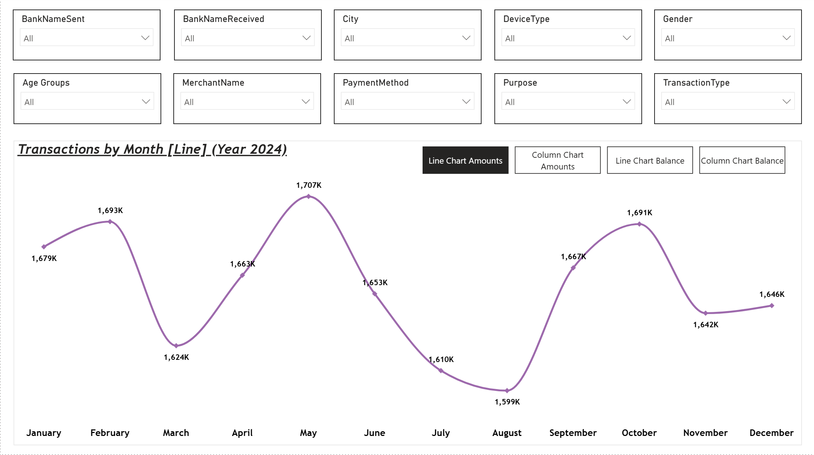
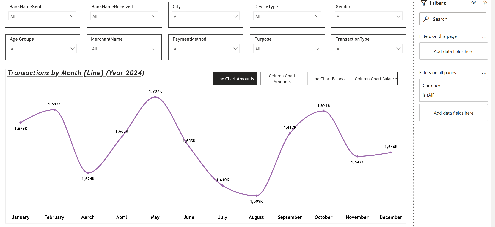
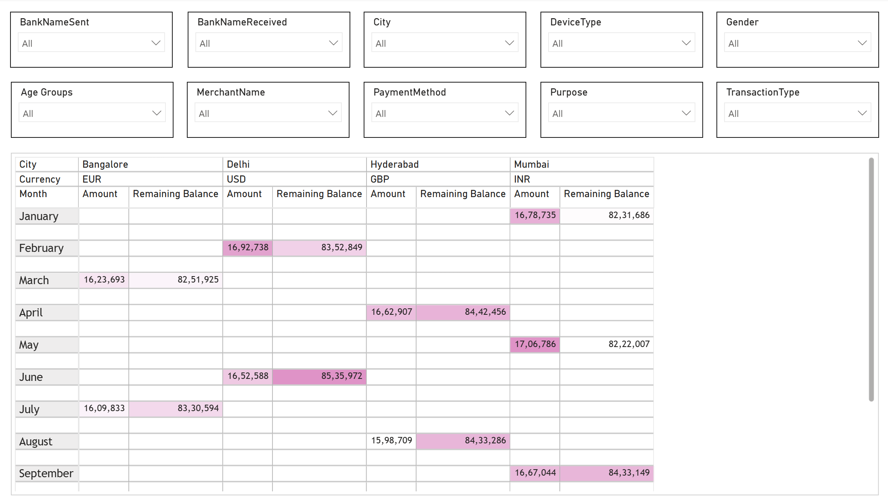
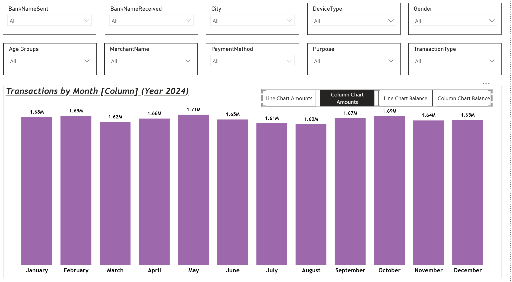
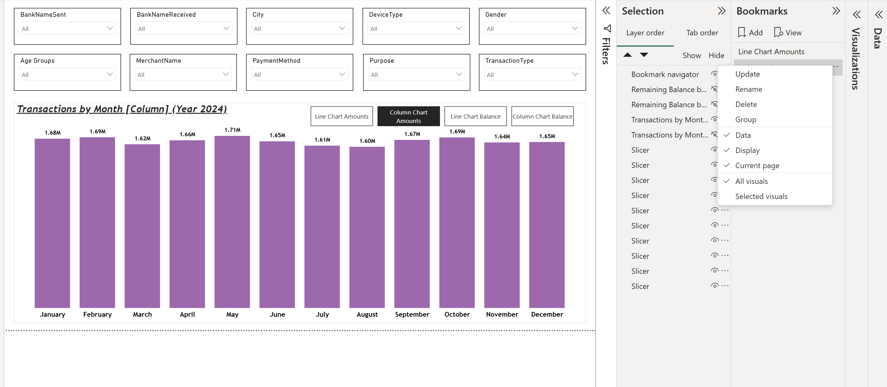
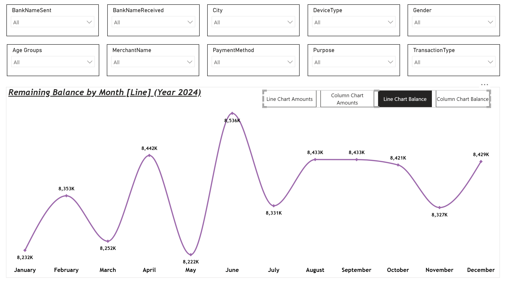
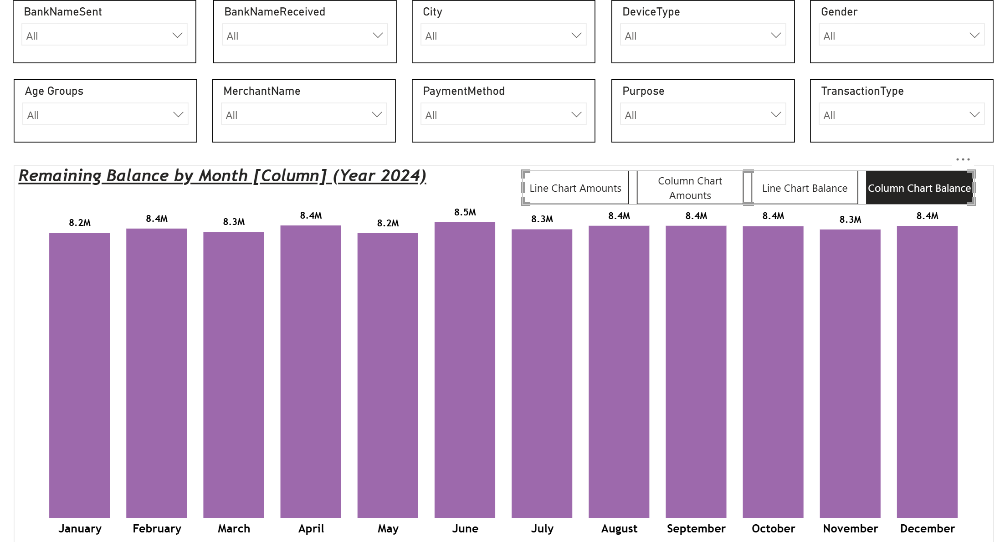

# UPI-Transactions-Data-Analysis

## Problem Statement

The objective of this dashboard is to analyze UPI transaction data and provide a clear view of transaction patterns over time. It helps users monitor monthly transaction amounts and remaining balances while analyzing the data across different cities and currencies.

The dashboard also provides interactive filters for key transaction attributes such as banks, city, device type, gender, age group, merchant, payment method, purpose, and transaction type. These filters allow users to explore the data based on specific requirements.

Additionally, the dashboard provides multiple visualizations for comparing transaction amounts and remaining balances through line and column charts, along with a matrix view for detailed city- and currency-wise analysis. This enables users to identify changes in transaction activity and examine transaction and balance patterns across different dimensions.

### Steps Followed

- **Step 1:** Loaded the UPI transactions dataset into Power BI and opened Power Query Editor for data transformation and preparation.

- **Step 2:** Observed that the `Transaction Time` field contained both date and time values, whereas only the transaction time was required for analysis. The column was split using a space as the delimiter, the date component was removed, and the remaining column was renamed to `Transaction Time`.

- **Step 3:** Created an `Age Groups` calculated column using DAX based on the `Customer Age` field to categorize customers into defined age groups.

- **Step 4:** Added slicers to enable interactive filtering of the dashboard. The slicers were configured for the following fields:
  - `BankNameSent`
  - `BankNameReceived`
  - `City`
  - `DeviceType`
  - `Gender`
  - `Age Groups`
  - `MerchantName`
  - `PaymentMethod`
  - `Purpose`
  - `TransactionType`

- **Step 5:** Duplicated the first report page to create a second page while retaining the same slicer configuration and overall layout. The duplicated page was then renamed according to its purpose and a suitable header image was added to the report.

- **Step 6:** On Page 1, added a line chart to represent how transaction amounts change over time. `Transaction Date` was added to the X-axis and `Amount` was added to the Y-axis. The date hierarchy was adjusted to display the required month-level data, and the data was represented for the year 2024. The visual was formatted with the required title, colors, and smooth line style. The title was set as **Transactions by Month, Year 2024**.

- **Step 7:** Added `Currency` as a page-level filter on both report pages so that the dashboard can be filtered based on the selected currency.

- **Step 8:** On Page 2, added a matrix visual to represent transaction `Amount` and `Remaining Balance` across different months, cities, and currencies. `Transaction Date` with the Month level was added to Rows, while `City` and `Currency` were added to Columns. `Amount` and `Remaining Balance` were added to Values.

- **Step 9:** Expanded the matrix hierarchy by using the **Expand all down one level in the hierarchy** option. This allowed the matrix to display the currency-level details under each city, making it possible to view the `Amount` and `Remaining Balance` for different currencies within each city.

- **Step 10:** Formatted the numerical values in the matrix by setting the decimal places to zero and applying the thousands separator, making large transaction amounts and remaining balances easier to read.

- **Step 11:** Synchronized the slicers across both report pages using the **Sync Slicers** feature. The slicers were configured to remain synchronized across the pages so that selecting a value, such as a particular bank, on one page would apply the same selection to the corresponding slicer on the other page.

- **Step 12:** Applied and tested the slicer synchronization by selecting filters on Page 1 and verifying that the same selections were reflected on Page 2. This was done for the different slicers used in the dashboard.

- **Step 13:** Applied conditional formatting to the `Amount` and `Remaining Balance` columns in the matrix visual. Background color formatting was used to visually distinguish the values, with higher amounts represented using darker shades and lower amounts using lighter shades.

- **Step 14:** Added an alternative column chart to provide users with the option to switch between the line chart and column chart for viewing transaction amounts. The existing line chart was duplicated and the copied chart was placed directly over the original chart so that both visuals occupied the same position.

- **Step 15:** Converted the duplicated chart into a column chart using the Visualization pane and renamed the visuals appropriately to distinguish between the line chart and column chart.

- **Step 16:** Opened the Selection pane from the View tab to manage the visibility of the report elements. The visuals were renamed appropriately, including the slicers and transaction charts, to make them easier to identify while configuring bookmarks.

- **Step 17:** Created bookmarks to control the visibility of the two transaction charts. Two bookmarks were created and renamed as **Line Chart Amounts** and **Column Chart Amounts**.

- **Step 18:** Configured the **Line Chart Amounts** bookmark so that the line chart was visible and the column chart was hidden. The visibility settings were updated in the bookmark using the Selection pane and the bookmark was updated to save the changes.

- **Step 19:** Similarly, configured the **Column Chart Amounts** bookmark so that the column chart was visible and the line chart was hidden. The bookmark was then updated to save the corresponding visibility settings.

- **Step 20:** Added a Bookmark Navigator using **Insert → Buttons → Navigator → Bookmark Navigator**. The navigator was placed above the charts and resized appropriately, allowing users to switch between the Line Chart Amounts and Column Chart Amounts views.

- **Step 21:** The Bookmark Navigator was positioned at the top of the chart section as required. The individual chart views can also be checked through the Bookmarks pane or by using **Ctrl + Click** on the corresponding bookmark during report editing.

- **Step 22:** Created two additional bookmarks for analyzing `Remaining Balance` using different chart types. The bookmarks were named **Line Chart Balance** and **Column Chart Balance**.

- **Step 23:** Duplicated the existing transaction chart and placed the copied visual over the existing chart to create a line chart for `Remaining Balance`. The Y-axis was changed from `Amount` to `Remaining Balance`.

- **Step 24:** Duplicated the balance line chart and converted the copied visual into a column chart. The visual was renamed appropriately to distinguish it from the balance line chart.

- **Step 25:** Configured the **Line Chart Balance** bookmark so that the balance line chart was visible and the corresponding column chart was hidden. The bookmark was updated to save the configured visibility settings.

- **Step 26:** Similarly, configured the **Column Chart Balance** bookmark so that the balance column chart was visible and the corresponding line chart was hidden. The bookmark was updated to save the changes.

- **Step 27:** Updated the existing amount-related bookmarks to maintain the correct visibility of all four chart views. The **Line Chart Amounts** bookmark was configured to display only the transaction amount line chart, while the other three chart views were hidden. The corresponding bookmark settings were updated accordingly.

- **Step 28:** Updated the remaining bookmarks similarly so that each bookmark displayed only its corresponding chart view:
  - **Line Chart Amounts** → Transaction Amounts Line Chart
  - **Column Chart Amounts** → Transaction Amounts Column Chart
  - **Line Chart Balance** → Remaining Balance Line Chart
  - **Column Chart Balance** → Remaining Balance Column Chart

## Insights

The following insights can be drawn from the dashboard:

### [1] Monthly Transaction Amount

The transaction amount shows variation throughout the year 2024.

- The **highest transaction amount** was recorded in **May**, at approximately **1.707M**.
- The **lowest transaction amount** was recorded in **August**, at approximately **1.599M**.
- Transaction amount increased from **1.624M in March** to **1.707M in May**, followed by a decline through August.
- After reaching the lowest value in August, transaction amount increased to approximately **1.691M in October** before declining again in November and December.

Thus, transaction amounts fluctuated throughout 2024, with May recording the highest and August recording the lowest displayed monthly value.

### [2] Monthly Remaining Balance

The remaining balance also varied across the months of 2024.

- The **highest remaining balance** was recorded in **June**, at approximately **8.536M**.
- The **lowest remaining balance** was recorded in **May**, at approximately **8.222M**.
- The remaining balance increased from **8.222M in May** to **8.536M in June**, representing the highest displayed balance during the year.
- From July onward, the remaining balance fluctuated between approximately **8.327M and 8.433M**, before reaching approximately **8.429M in December**.

Thus, the remaining balance remained within a relatively narrow range throughout the year, with June showing the highest and May showing the lowest displayed monthly value.

### [3] Comparison of Transaction Amount and Remaining Balance

- The monthly **transaction amount** remained in the approximate range of **1.599M to 1.707M** during 2024.
- The monthly **remaining balance** remained in the approximate range of **8.222M to 8.536M**.
- The highest transaction amount occurred in **May**, whereas the highest remaining balance occurred in **June**.
- The lowest transaction amount occurred in **August**, whereas the lowest remaining balance occurred in **May**.

### [4] City and Currency-wise Analysis

The matrix visual provides a month-wise breakdown of `Amount` and `Remaining Balance` based on **City** and **Currency**. This enables the user to examine transaction amounts and balances for individual city-currency combinations.

For example, the displayed data includes:

- **January:** Mumbai – INR
- **February:** Delhi – USD
- **March:** Bangalore – EUR
- **April:** Hyderabad – GBP
- **May:** Mumbai – INR
- **June:** Delhi – USD
- **July:** Bangalore – EUR
- **August:** Hyderabad – GBP
- **September:** Mumbai – INR

The matrix also uses conditional formatting to make higher values visually darker and lower values lighter, making differences in transaction amounts and remaining balances easier to identify.

